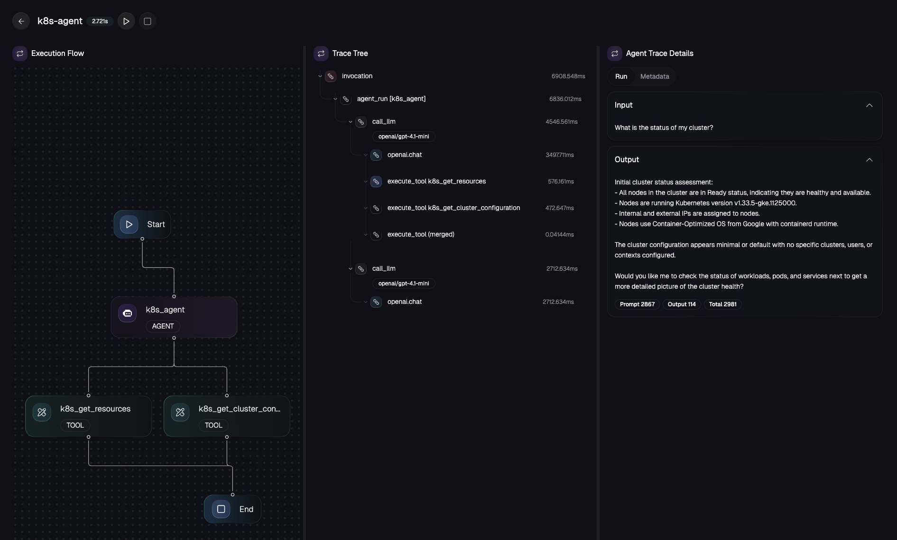
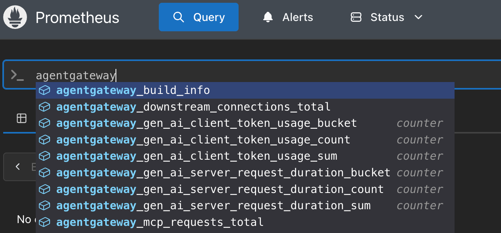
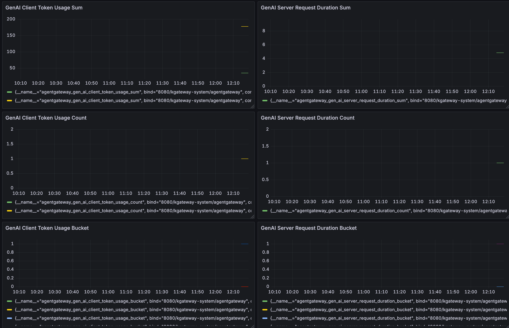

# kagent and agentgateway enterprise demo



The purpose of this repo is to showcase how both kagent and agentgateway work at an enterprise level. You will see:

1. Installation and configuration
2. Managing kagent and agentgateway within the UI
3. Agent deployment and mcp server deployment at the declarative level using CRDs in a Kubernetes environment
4. Making calls to LLMs like Claude using agentgateway
5. Metrics and tracing data both within the kagent/agentgateway UI and a modern monitoring and observability tool of your choice (like Grafana/Prometheus)
6. Creation of MCP servers declaratively using kmcp

## Solo Enterprise For Kagent Installation And Configuration

1. Set env variables

```
export SOLO_LICENSE_KEY=<key>
export GLOO_GATEWAY_LICENSE_KEY=<key>
export AGENTGATEWAY_LICENSE_KEY=<key>
export OPENAI_API_KEY=
```

2. create the `kagent` Namespace
```
kubectl create ns kagent
```

3. Create the secrets for your LLM and the backend secret which contains the OIDC secret
```
kubectl apply -f - <<EOF
apiVersion: v1
kind: Secret
metadata:
  name: llm-api-keys
  namespace: kagent
type: Opaque
stringData:
  OPENAI_API_KEY: ${OPENAI_API_KEY}
EOF
```

```
kubectl apply -f - <<EOF
apiVersion: v1
kind: Secret
metadata:
  name: kagent-backend-secret
  namespace: kagent
type: Opaque
stringData:
  clientSecret: ${BACKEND_CLIENT_SECRET}
  secret: ${BACKEND_CLIENT_SECRET}
EOF
```

4. When a user sends a request to the Agent, we use the token from Keycloak to authenticate the request to the Agent. Then, we do a token delgation that allows the Agent to send another request on behalf of the user. To do that, system-level authentication is needed. That's what this secret creates
```
openssl genpkey -algorithm RSA -out /tmp/key.pem -pkeyopt rsa_keygen_bits:2048

kubectl create secret generic jwt -n kagent --from-file=jwt=/tmp/key.pem
```

5. Install the Gloo Operator
```
helm upgrade -i gloo-operator oci://us-docker.pkg.dev/solo-public/gloo-operator-helm/gloo-operator \
--version 0.4.2 \
-n kagent \
--create-namespace \
--values - <<EOF
manager:
  env:
    KAGENT_CONTROLLER: true
    WATCH_NAMESPACES: "kagent"
    GLOO_GATEWAY_LICENSE_KEY: ${GLOO_GATEWAY_LICENSE_KEY}
    AGENTGATEWAY_LICENSE_KEY: ${AGENTGATEWAY_LICENSE_KEY}
    SOLO_ISTIO_LICENSE_KEY: ${SOLO_LICENSE_KEY}
EOF
```

6. Set up kagent enterprise via the Controller

```
kubectl apply -n kagent -f - <<EOF
apiVersion: v1
kind: ConfigMap
metadata:
  name: gloo-extensions-config
data:
  # Solo Enterprise for kagent settings
  values.management: |
    cluster: $CLUSTER1_NAME
---
apiVersion: operator.gloo.solo.io/v1
kind: ServiceMeshController
metadata:
  name: managed-istio
  labels:
    app.kubernetes.io/name: managed-istio
spec:
  dataplaneMode: Ambient
  installNamespace: istio-system
  version: 1.27.1
  scalingProfile: Demo
---
apiVersion: operator.gloo.solo.io/v1
kind: GatewayController
metadata:
  name: gloo-gateway
spec:
  version: 2.0.1
---
apiVersion: operator.gloo.solo.io/v1
kind: KagentManagementController
metadata:
  name: kagent-enterprise
spec:
  version: 0.1.10
  repository:
    url: oci://us-docker.pkg.dev/solo-public/kagent-enterprise-helm/charts
  oidc:
    clientID: ${OIDC_BACKEND}
    clientSecret: kagent-backend-secret
    issuer: ${OIDC_ISSUER}
    authEndpoint: ${authEndpoint}
    logoutEndpoint: ${logoutEndpoint}
    tokenEndpoint: ${tokenEndpoint}
---
apiVersion: operator.gloo.solo.io/v1
kind: KagentController
metadata:
  name: kagent
spec:
  version: 0.1.9
  repository:
    url: oci://us-docker.pkg.dev/solo-public/kagent-enterprise-helm/charts
  apiKey:
    type: OpenAI
    secretRef: 
      name: llm-api-keys
      namespace: kagent
  oidc:
    clientId: ${OIDC_BACKEND}
    issuer: ${OIDC_ISSUER}
    secretRef: kagent-backend-secret
    secret: ${BACKEND_CLIENT_SECRET}
  telemetry:
    logging:
      endpoint: kagent-enterprise-ui.kagent.svc.cluster.local:4317
    tracing:
      endpoint: kagent-enterprise-ui.kagent.svc.cluster.local:4317
EOF
```

7. Give it about 2-3 minutes for the entire env to get up and running

```
kubectl get pods -n istio-system
kubectl get pods -n gloo-system
kubectl get po -n kagent | grep -E "ui|clickhouse"
kubectl get po -n kagent -l app.kubernetes.io/instance=kagent-enterprise
kubectl get po -n kagent -l app=kagent
```

8. Get the ALBs public IP for the UI service and open it in a browser:
```
kubectl get svc -n kagent

kagent-enterprise-ui             LoadBalancer   x.x.x.x   x.x.x.x   9000:31516/TCP,8080:31314/TCP,80:30674/TCP,8090:32263/TCP,8091:32015/TCP,4316:31332/TCP,4317:32230/TCP,4318:30388/TCP   3m6s
```

## Declarative Agent And MCP Server Configuration (SAP CAP MCP Server)

The config below It works very much like a package/library import in application code.

When you apply this `MCPServer` resource to your Kubernetes cluster via kagent:

1. kagent (the Kubernetes agent) sees the MCPServer resource
2. It automatically creates a deployment that runs npx `kubernetes-mcp-server@latest`
3. npx fetches the latest version of the `kubernetes-mcp-server` package from npm (just like `pip install` or `npm install` would)
4. The MCP server starts running in a Pod and becomes available via the stdio transport

kagent handles the "package resolution" and deployment automatically. You just declare what MCP server you want (like declaring a dependency in `package.json` or `requirements.txt`), and kagent takes care of fetching, installing, and running it in your cluster.

This is the power of the declarative approach. You specify what you want (the `sap-cap-mcp-server`), and kagent figures out how to get it running.

https://github.com/cap-js/mcp-server
https://cap.cloud.sap/docs/

1. Create a new SAP CAP MCP Server object in Kubernetes
```
kubectl apply -f - <<EOF
apiVersion: kagent.dev/v1alpha1
kind: MCPServer
metadata:
  name: mcp-sap-cap-server
  namespace: kagent
spec:
  deployment:
    args:
    - "-y"
    - "@cap-js/mcp-server@latest"
    cmd: npx
  stdioTransport: {}
  transportType: stdio
EOF
```

2. Create a new Agent and use the SAP CAP MCP Server you created in step 1
```
kubectl apply -f - <<EOF
apiVersion: kagent.dev/v1alpha2
kind: Agent
metadata:
  name: sap-cap-agent
  namespace: kagent
spec:
  description: This agent can use SAP Cloud Application Programming Model (CAP) tools to help with AI-assisted development of CAP applications
  type: Declarative
  declarative:
    modelConfig: default-model-config
    systemMessage: |-
      You're a friendly and helpful agent that uses SAP CAP tools to assist with cloud application development

      # Instructions

      - If user question is unclear, ask for clarification before running any tools
      - Always be helpful and friendly
      - If you don't know how to answer the question DO NOT make things up
        respond with "Sorry, I don't know how to answer that" and ask the user to further clarify the question
      - Use search_model to find CDS model definitions (entities, fields, services, annotations)
      - Use search_docs to search CAP documentation for development guidance

      # Response format
      - ALWAYS format your response as Markdown
      - Your response will include a summary of actions you took and an explanation of the result
    tools:
    - type: McpServer
      mcpServer:
        name: mcp-sap-cap-server
        kind: MCPServer
        toolNames:
        - search_model
        - search_docs
EOF
```

3. Look at the Agent configuration and wait until both `READY` and `ACCEPTED` are in a `True` status
```
kubectl get agents -n kagent
```

4. Feel free to dive into how it looks "underneath the hood"
```
kubectl describe agent sap-cap-agent -n kagent
```

## Monitoring And Observability Setup

1. Add the Prometheus Helm Chart

```
helm repo add prometheus-community https://prometheus-community.github.io/helm-charts
```

2. Install Kube-Prometheus
```
helm install kube-prometheus -n monitoring prometheus-community/kube-prometheus-stack --create-namespace
```

3. Deploy a Pod Monitor

The `PodMonitor` selector matches `gateway.networking.k8s.io/gateway-class-name: agentgateway`, which will match any Gateway that uses the agentgateway GatewayClass
```
kubectl apply -f - <<EOF
apiVersion: monitoring.coreos.com/v1
kind: PodMonitor
metadata:
  name: agentgateway
  namespace: gloo-system
  labels:
    app: agentgateway
    release: kube-prometheus
spec:
  selector:
    matchLabels:
      gateway.networking.k8s.io/gateway-class-name: agentgateway-enterprise
  podMetricsEndpoints:
  - port: metrics
    path: /metrics
    interval: 30s
    scrapeTimeout: 10s
EOF
```

To look at the metrics in Prometheus
```
kubectl --namespace monitoring port-forward svc/kube-prometheus-kube-prome-prometheus 9090
```

To build a dashboard with the metrics
```
kubectl --namespace monitoring port-forward svc/kube-prometheus-grafana 3000:80
```

To log into the Grafana UI:

1. Username: admin
2. Password: prom-operator

## Configuring OTel

OpenTelemetry, typically called OTel, is almost like a bucket that you fill. When you want to see something in the bucket, you take it out. From an observability perspective, let's say you want to send metrics/logs/traces to multiple places or you want to switch from one monitoring and observability tool to another. With OTel, it's a collection of observability data (sitting in a bucket) and you can "pick out what you want from that bucket" and send it to the appropriate monitoring and observability tool.

1. Install the OTel collector
```
helm upgrade --install opentelemetry-collector-traces opentelemetry-collector \
--repo https://open-telemetry.github.io/opentelemetry-helm-charts \
--version 0.127.2 \
--set mode=deployment \
--set image.repository="otel/opentelemetry-collector-contrib" \
--set command.name="otelcol-contrib" \
--namespace=telemetry \
--create-namespace \
-f -<<EOF
config:
  receivers:
    otlp:
      protocols:
        grpc:
          endpoint: 0.0.0.0:4317
        http:
          endpoint: 0.0.0.0:4318
  exporters:
    otlp/tempo:
      endpoint: http://tempo.telemetry.svc.cluster.local:4317
      tls:
        insecure: true
    debug:
      verbosity: detailed
  service:
    pipelines:
      traces:
        receivers: [otlp]
        processors: [batch]
        exporters: [debug, otlp/tempo]
EOF
```

2. Ensure that its running
```
kubectl get pods -n telemetry
```

3. The configmap below specifies the tracing endpoint and a few extra metrics that you want to be collected within your trace
```
kubectl apply -f- <<EOF
apiVersion: v1
kind: ConfigMap
metadata:
  name: agent-gateway-config
  namespace: gloo-system
data:
  config.yaml: |-
    config:
      tracing:
        otlpEndpoint: http://opentelemetry-collector-traces.telemetry.svc.cluster.local:4317
        otlpProtocol: grpc
        randomSampling: true
        fields:
          add:
            gen_ai.operation.name: '"chat"'
            gen_ai.system: "llm.provider"
            gen_ai.request.model: "llm.requestModel"
            gen_ai.response.model: "llm.responseModel"
            gen_ai.usage.completion_tokens: "llm.outputTokens"
            gen_ai.usage.prompt_tokens: "llm.inputTokens"
EOF
```

4. Set up a parameters object to reference the configmap for collecting traces.
```
kubectl apply -f- <<EOF
apiVersion: gloo.solo.io/v1alpha1
kind: GlooGatewayParameters
metadata:
  name: tracing
  namespace: gloo-system
spec:
  kube:
    agentgateway:
      customConfigMapName: agent-gateway-config
EOF
```

## Testing LLM Connectivity

1. Create env variable for Anthropic key

```
export ANTHROPIC_API_KEY=
```

2. Create a Gateway for Anthropic

A `Gateway` resource is used to trigger Gloo Gateway to deploy agentgateway data plane Pods

The Agentgateway data plane Pod is the Pod that gets created when a Gateway object is created in a Kubernetes environment where Agentgateway is deployed as the Gateway API implementation.

You'll also see the `parameterRef` section, which is used to capture traces (which is what you set up in the previous section)
```
kubectl apply -f- <<EOF
kind: Gateway
apiVersion: gateway.networking.k8s.io/v1
metadata:
  name: agentgateway
  namespace: gloo-system
  labels:
    app: agentgateway
spec:
  gatewayClassName: agentgateway-enterprise
  infrastructure:
    parametersRef:
      name: tracing
      group: gloo.solo.io
      kind: GlooGatewayParameters
  listeners:
  - protocol: HTTP
    port: 8080
    name: http
    allowedRoutes:
      namespaces:
        from: All
EOF
```

3. Capture the LB IP of the service. This will be used later to send a request to the LLM.
```
export INGRESS_GW_ADDRESS=$(kubectl get svc -n gloo-system agentgateway -o jsonpath="{.status.loadBalancer.ingress[0]['hostname','ip']}")
echo $INGRESS_GW_ADDRESS
```

4. Create a secret to store the Claude API key
```
kubectl apply -f- <<EOF
apiVersion: v1
kind: Secret
metadata:
  name: anthropic-secret
  namespace: gloo-system
  labels:
    app: agentgateway
type: Opaque
stringData:
  Authorization: $ANTHROPIC_API_KEY
EOF
```

5. Create a `Backend` object 

A Backend resource to define a backing destination that you want kgateway to route to. In this case, it's Claude.
```
kubectl apply -f- <<EOF
apiVersion: gateway.kgateway.dev/v1alpha1
kind: AgentgatewayBackend
metadata:
  labels:
    app: agentgateway
  name: anthropic
  namespace: gloo-system
spec:
  ai:
    provider:
        anthropic:
          model: "claude-3-5-haiku-latest"
  policies:
    auth:
      secretRef:
        name: anthropic-secret
EOF
```

6. Ensure everything is running as expected
```
kubectl get backend -n gloo-system
```

7. Apply the Route so you can reach the LLM
```
kubectl apply -f- <<EOF
apiVersion: gateway.networking.k8s.io/v1
kind: HTTPRoute
metadata:
  name: claude
  namespace: gloo-system
  labels:
    app: agentgateway
spec:
  parentRefs:
    - name: agentgateway
      namespace: gloo-system
  rules:
  - matches:
    - path:
        type: PathPrefix
        value: /anthropic
    filters:
    - type: URLRewrite
      urlRewrite:
        path:
          type: ReplaceFullPath
          replaceFullPath: /v1/chat/completions
    backendRefs:
    - name: anthropic
      namespace: gloo-system
      group: gateway.kgateway.dev
      kind: Backend
EOF
```

8. Test the LLM connectivity
```
curl "$INGRESS_GW_ADDRESS:8080/anthropic" -H content-type:application/json -H x-api-key:$ANTHROPIC_API_KEY -H "anthropic-version: 2023-06-01" -d '{
  "messages": [
    {
      "role": "system",
      "content": "You are a skilled cloud-native network engineer."
    },
    {
      "role": "user",
      "content": "Write me a paragraph containing the best way to think about Istio Ambient Mesh"
    }
  ]
}' | jq
```

9. You can check that the request went through the Gateway:

```
kubectl logs -n gloo-system agentgateway-b6658b4f4-26pdf --tail=50 | grep -i "request\|error\|anthropic"
```

You should now be able to see the metrics in Prometheus




## Traces
To look at traces, you can see the logs and the trace ID. The reason why you don't have to do another configuration is because when you set up the gateway in the **Testong LLM Connectivity** section, under the `infrastructure` mapping via the `Gateway` object, traces were enabled.

1. Get the logs for agentgateway
```
kubectl logs deploy/agentgateway -n gloo-system
```

2. Look for the `trace.id=`

3. Look at the logs for the OTel tracing collector and you'll be able to see the trace ID
```
kubectl logs deploy/opentelemetry-collector-traces -n telemetry
```

## kmcp

When you're creating MCP Servers and connections to MCP Servers, it goes something like the following:

1. Write an MCP Server with a library you're comfortable with. You'll see a lot done in Python or JS, but there are several SDKs in various languages available.
2. Create a client to connect to the MCP Server

Although that's not out of the ordinary (client/server programmatic configurations have been written for years), the question you have to ask yourself is "Do I want to do this for every MCP Server I want to use and/or create?"

That's why you can use kmcp instead.

kmcp is a way to create MCP Servers for local development or to deploy to a Kubernetes environment. Utilizing objects via the kmcp CRDs like MCPServer, you can declaratively manage your MCP Servers within the orchestration layer (Kubernetes) that you're already used to. Because it's deployed within Kubernetes, you can manage your MCP Servers like any other workload.

1. Download the kmcp binary
```
curl -fsSL https://raw.githubusercontent.com/kagent-dev/kmcp/refs/heads/main/scripts/get-kmcp.sh | bash
```

2. Initialize the project which creates an MCP Server template for you
```
kmcp init python mlevan-fe
```

3. Turn the MCP Server into a container image
```
kmcp build --project-dir mlevan-fe -t pythontesting:latest
```

4. Install the kmcp CRDs
```
helm install kmcp-crds oci://ghcr.io/kagent-dev/kmcp/helm/kmcp-crds \
  --namespace kmcp-system \
  --create-namespace
```

5. Install kmcp on the cluster
```
kmcp install
```

6. Ensure that it is running as expected
```
kubectl get pods -n kmcp-system
```

7. Deploy the MCP Server declaratively
```
kubectl apply -f- <<EOF
apiVersion: kagent.dev/v1alpha1
kind: MCPServer
metadata:
  name: mlevan-fe
spec:
  deployment:
    image: "adminturneddevops/pythontesting:latest"
    port: 3000
    cmd: "python"
    args: ["src/main.py"]
  transportType: "stdio"
EOF
```

8. If you built your MCP Server container image on something like an M4 Mac (ARM-based architecture), you'll need to add in an ARM-based Worker Node and patch your deployment for to select the ARM-based node.
```
kubectl patch deployment mlevan-fe -n default -p '{"spec":{"template":{"spec":{"nodeSelector":{"kubernetes.io/arch":"arm64"}}}}}'
```

kubectl get pods


## Bonus: MCP Server On Kubernetes
1. Create an MCP config so you can see the metrics for MCP Servers

```
kubectl apply -f- <<EOF
apiVersion: apps/v1
kind: Deployment
metadata:
  name: mcp-website-fetcher
  namespace: default
spec:
  selector:
    matchLabels:
      app: mcp-website-fetcher
  template:
    metadata:
      labels:
        app: mcp-website-fetcher
    spec:
      containers:
      - name: mcp-website-fetcher
        image: ghcr.io/peterj/mcp-website-fetcher:main
        imagePullPolicy: Always
---
apiVersion: v1
kind: Service
metadata:
  name: mcp-website-fetcher
  namespace: default
spec:
  selector:
    app: mcp-website-fetcher
  ports:
  - port: 80
    targetPort: 8000
    appProtocol: kgateway.dev/mcp
EOF
```

2. Create the Backend
```
kubectl apply -f- <<EOF
apiVersion: gateway.kgateway.dev/v1alpha1
kind: AgentgatewayBackend
metadata:
  name: mcp-backend
  namespace: kgateway-system
spec:
  mcp:
    targets:
    - name: mcp-target
      static:
        host: mcp-website-fetcher.default.svc.cluster.local
        port: 80
        protocol: SSE
EOF
```

3. Create the Route
```
kubectl apply -f- <<EOF
apiVersion: gateway.networking.k8s.io/v1
kind: HTTPRoute
metadata:
  name: mcp-route
  namespace: kgateway-system
spec:
  parentRefs:
  - name: agentgateway
  rules:
  - backendRefs:
    - name: mcp-backend
      group: gateway.kgateway.dev
      kind: Backend
EOF
```

4. Test the MCP connection
```
export GATEWAY_IP=$(kubectl get svc agentgateway -n kgateway-system -o jsonpath='{.status.loadBalancer.ingress[0].ip}')

curl -N "http://${GATEWAY_IP}:8080/sse" \
  -H "Accept: text/event-stream"
```

```
curl "http://${GATEWAY_IP}:8080/" \
  -H "Content-Type: application/json" \
  -H "Accept: application/json, text/event-stream" \
  -d '{
    "jsonrpc": "2.0",
    "method": "initialize",
    "params": {
      "protocolVersion": "2024-11-05",
      "capabilities": {},
      "clientInfo": {
        "name": "test-client",
        "version": "1.0.0"
      }
    },
    "id": 1
  }'
```